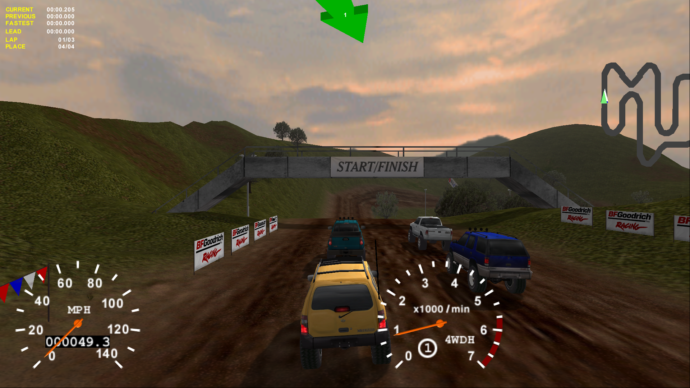
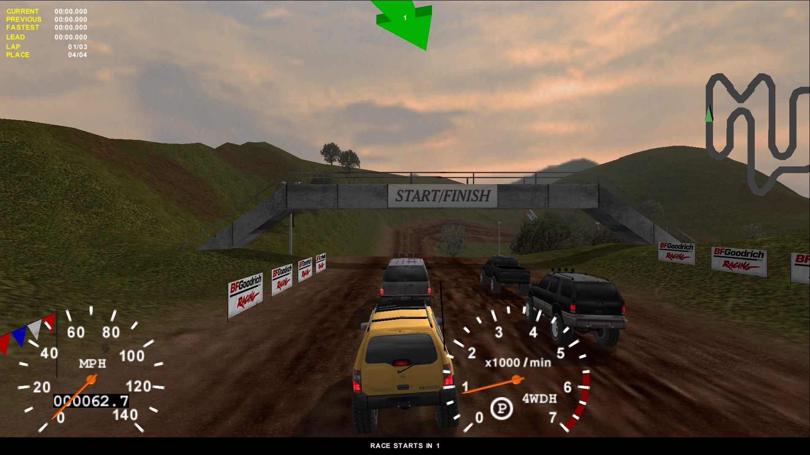
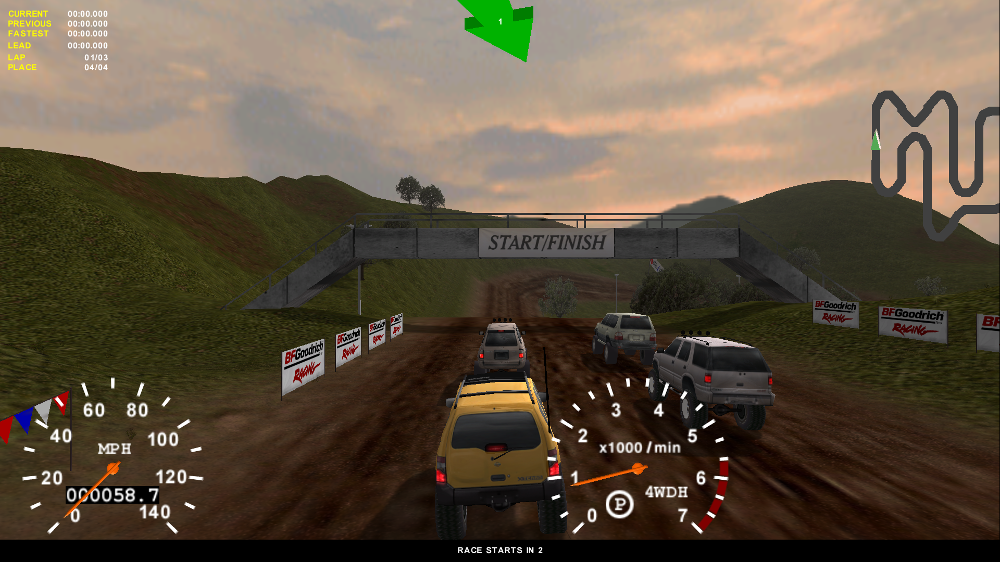

# 4x4e

## Project
4x4e is an open source implementation of Terminal Reality's [4x4 Evolution](https://en.wikipedia.org/wiki/4x4_Evo) Build 57 from early 2000s.

## Goals
There are multiple goals this project tries to achieve:
1. Learn how games were made in an era when things had to be done in the code, and not through fancy game engines like today.
2. Have a fully playable game implemented end-to-end, including resource management, audio, and video rendering, as well as support of large screen resolutions.
3. Eventually, to support 64-bit compilation for modern systems, and provide an avenue for development of modern renderer implementations such as DirectX or Vulkan.
4. Also, eventually, to support modern input devices that do not comply with DirectInput, and even port to Linux or Mac.

## Requirements & Dependencies
1. [Microsoft Visual Studio](https://visualstudio.microsoft.com/downloads/)
2. [Microsoft DirectX 9.0 SDK (June 2010)](https://www.microsoft.com/en-US/download/details.aspx?id=6812) 

## Screen Shots
### DirectX 7.0

### OpenGL 1.1

### DirectX 9.0

DirectX 9.0 renderer is a back-ported version of DirectX 8.0 renderer from [4x4e2](https://github.com/americusmaximus/4x4e2). 4x4 Evolution 2 has DirectX 8.0 renderers that were also updated to DirectX 9.0. This renderer is also important for the future 64-bit compatibility.

## Notes
1. The original game was compiled by Watcom C/C++ compiler, it contains the following sting: `WATCOM C/C++32 Run-Time system. (c) Copyright by WATCOM International Corp. 1988-1995. All rights reserved.`. The game and the modules use cdecl calling convention.
2. The target game is Build 57, which is quite different from the original release, also known as Build 44. The code is **NOT** compatible with the original release.
4. DirectX 7.0 performance desires to be better. It seems like it is being fully software emulated these days, moreover, some graphic cards drivers have incorrect or inomplete support of DirectX 7.0, thus using other renderers is encouraged for better performance.
5. This project has no connection to the work that the community of the [4x4 Evolution Revival Project](https://www.4x4evolution.net/doku.php?id=start) does.

## Thanks
1. Thanks to [My Abandonware](https://www.myabandonware.com/) for providing [4x4 Evo](https://www.myabandonware.com/game/4x4-evo-3fl) and the Build 57 patch.
2. Thanks to [4x4 Evolution Revival Project](https://www.4x4evolution.net/doku.php?id=start) for providing custom track files (.lte), this was very helpful for testing.

## Legal
1. This is not a complete game. Please purchase software you like!
2. The source code in this repository is mostly produced by reverse engineering the original binaries. There are a couple of exceptions for reverse engineering under DMCA -- documentation, interoperability, fair use. See goals section for the interoperability and fair use cases. The documentation is needed to support those. Also please see an article about [software preservation](https://en.wikipedia.org/wiki/Digital_preservation).
3. 4x4 Evolution, DirectX, OpenGL, Vulkan, and others are trademarks of their respective owners.
